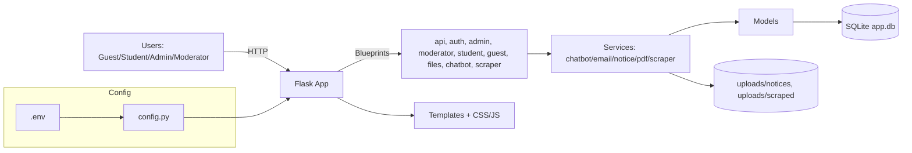

# Campus Management Assistant Chatbot (Agnostic)

An end‑to‑end, institution‑agnostic campus assistant built on Flask. It provides a chatbot for students, guests, and staff, plus dashboards for admins and moderators to manage notices, FAQs, scraping sources, logs, and users. The app is designed to run out‑of‑the‑box with SQLite and can be branded to any college domain via environment configuration.

> Status: Chatbot currently runs in static‑knowledge mode (no external APIs). Optional LLM integration can be enabled later.


## Highlights

- Chatbot with static knowledge (role‑aware) + optional web scraping
- Admin/moderator dashboards for notices, FAQs, users, logs
- Secure auth via Flask‑Login, session enforcement for deactivated users
- Auto‑created SQLite database and default admin on first boot
- Email, PDF parsing, and scraping services included
- Simple asset serving for `frontend/css` and `frontend/js`

## Folder Structure

```
campus-management-assistant/
├─ app/
│  ├─ routes/           # blueprints: api, auth, admin, moderator, student, guest, files, chatbot, scraper
│  ├─ services/         # business logic: chatbot/email/notice/pdf/scraper/etc.
│  ├─ models/           # SQLAlchemy models: user, logs, faq, notice*, scraper, chatbot_document
│  ├─ frontend/         # Jinja templates + static assets
│  ├─ uploads/          # notices/ and scraped/ files
│  ├─ database/         # SQLite app.db
│  ├─ extensions.py     # db, login_manager
│  ├─ config.py         # loads .env, builds DB path
│  └─ __init__.py       # create_app(), blueprint registration, bootstrapping
├─ requirements.txt
├─ run.py               # entrypoint (dev server)
├─ scripts/             # utilities/tests helpers
└─ tests/               # API/route tests and UI tests (Playwright in repo root)
```

## Architecture

- Flask app created in `app/__init__.py` using `create_app()`
- Blueprints: `api`, `auth`, `admin`, `moderator`, `student`, `guest`, `files`, `chatbot`, `scraper`
- Persistence: SQLAlchemy with SQLite at `app/database/app.db`
- Services: `chatbot_service`, `email_service`, `notice_service`, `pdf_service`, `scraper_service`
- Models: `user`, `logs`, `faq`, `notice`, `notice_category`, `notice_file`, `scraper`, `chatbot_document`

### Diagram



## Requirements

Python 3.10+ (3.11 recommended). Install from `requirements.txt`:

- Flask, Flask‑SQLAlchemy, Flask‑Login
- python‑dotenv, requests, beautifulsoup4
- pdfplumber
- google‑generativeai (optional; current mode is static knowledge)

## Quick Start

1) Create and activate a virtual environment, then install dependencies:

```powershell
# From d:\mn\campus-management-assistant
python -m venv .\venv
. .\venv\Scripts\Activate.ps1
pip install -r requirements.txt
```

2) Configure environment (create `.env` in the project root):

```
SECRET_KEY=change_me
COLLEGE_DOMAIN=example.edu
ADMIN_LOGIN_ID=admin
ADMIN_PASSWORD=admin123
```

3) Run the app:

```powershell
python .\run.py
# Server starts on http://127.0.0.1:5000
```

On first startup, the app ensures the database exists and creates a default admin using `ADMIN_LOGIN_ID`/`ADMIN_PASSWORD`.

## Notable Routes

- `GET /` and role‑specific views via blueprints (`guest`, `student`, `moderator`, `admin`)
- Chatbot UIs:
	- `GET /guest/chatbot`, `POST /guest/chatbot`
	- `POST /student/chatbot` (requires login, student role)
	- `POST /chatbot/query` (JSON API)
	- `GET /chatbot/health`
- Programmatic endpoints under `/api` (see [app/routes/api.py](app/routes/api.py))
- Assets: `GET /css/<file>`, `GET /js/<file>` served from `frontend/`

## Environment Variables

Set in `.env` at project root:

- SECRET_KEY: session signing key (required)
- COLLEGE_DOMAIN: domain used for branding and email fallbacks (optional)
- ADMIN_LOGIN_ID: initial admin login id (optional, default `admin`)
- ADMIN_PASSWORD: initial admin password (optional, default `admin123`)

## Usage

- First run creates the database and (if missing) a default admin.
- Login as admin → add moderators/students, manage notices/FAQs, configure scraping sources.
- Students can ask the chatbot (student visibility); guests can use the guest chatbot (public visibility).
- Scraper and PDF parsing services help ingest official content for the assistant.

## Data & Storage

- Database file: `app/database/app.db` (auto‑created)
- Uploads: `app/uploads/notices`, `app/uploads/scraped`

## Admin & Security

- Auth via Flask‑Login; sessions invalidated for deactivated users
- Default admin is created on boot if none exists
- Use a strong `SECRET_KEY` in production; change default credentials

## Development Tips

- Blueprints are registered in `app/__init__.py`
- Environment loading via `app/config.py` using `.env`
- To inspect/alter models, use Flask shell or a SQLite browser
- UI tests available under the repo’s `tests/ui` (Playwright)

Run Python tests:

```powershell
python -m pytest -q
```

Run UI tests (requires Node.js):

```bash
npm install
npx playwright install
npx playwright test
```

## Troubleshooting

- If the DB schema evolves, the app attempts lightweight migrations on boot
- Delete `app/database/app.db` to reset local data (dev only)
- Check `.env` paths and ensure the virtual environment is active

## Screenshots

Place screenshots under `assets/screenshots/` and they will render here:


## Deployment

- Use a production WSGI server (e.g., Waitress on Windows, Gunicorn on Linux) behind a reverse proxy.
- Set a strong `SECRET_KEY` and change default admin credentials.
- Move SQLite to a persistent location or upgrade to a managed RDBMS if needed.
- Configure logs rotation and health checks (`/chatbot/health`).

## Contributing

- Open issues and PRs with clear descriptions.
- Keep style consistent; avoid introducing heavy frameworks or breaking agnostic design.

## License

Proprietary or institution‑specific. Adapt as needed for your deployment.
