# Campus Management Assistant

A comprehensive, role-based campus management platform built with **Flask**, featuring intelligent chatbot assistance, content management for notices & FAQs, admin dashboards, web scraping integration, and multi-user authentication. Designed for colleges and institutes to streamline student communication and administrative workflows.


---

## 🎯 Overview

**Campus Management Assistant** is a complete solution for academic institutions to:

- **Support Students & Guests** with an intelligent chatbot answering FAQs, exam info, hostel rules, admission details
- **Manage Content** through admin dashboards for notices, FAQs, user accounts, and system logs
- **Automate Data Collection** via web scraper integration to pull official announcements
- **Enforce Access Control** with role-based dashboards (Guest, Student, Moderator, Admin)
- **Scale Easily** with a modular Flask architecture and extensible service layer

> 🤖 **Chatbot**: Runs in static-knowledge mode with 45+ questions across English, Hindi, Tamil, Telugu, and Marathi. Optional LLM integration available for future enhancement.

---

## 🏗️ Architecture Overview

```
┌─────────────────────────────────────────────────────────────────┐
│                     Users (Browser/HTTP)                        │
│         Guest | Student | Moderator | Admin                     │
└────────────────────┬────────────────────────────────────────────┘
                     │ HTTP Requests
                     ▼
        ┌────────────────────────────────────┐
        │      Flask Application             │
        │  (Static Frontend + REST API)      │
        └────────────┬───────────────────────┘
                     │
        ┌────────────┴──────────────────────┐
        │                                   │
        ▼                                   ▼
┌──────────────────┐            ┌──────────────────┐
│  Blueprints      │            │  Static Files    │
│  (Routes)        │            │  (/css, /js)     │
└──────────────────┘            └──────────────────┘
│ ├─ auth         │
│ ├─ guest        │
│ ├─ student      │
│ ├─ moderator    │
│ ├─ admin        │
│ ├─ api          │
│ ├─ files        │
│ ├─ chatbot      │
│ └─ scraper      │
        │
        ▼
┌──────────────────────────────────────────┐
│           Service Layer                  │
│ ├─ chatbot_service                       │
│ ├─ notice_service                        │
│ ├─ faq_service                           │
│ ├─ email_service                         │
│ ├─ pdf_service                           │
│ ├─ scraper_service                       │
│ └─ logs_service                          │
└──────────┬───────────────────────────────┘
           │
           ▼
┌──────────────────────────────────────────┐
│        SQLAlchemy ORM Models             │
│ ├─ User (with roles/permissions)         │
│ ├─ Notice, NoticeCategory, NoticeFile    │
│ ├─ FAQ (with department filtering)       │
│ ├─ Logs (audit trail)                    │
│ ├─ Scraper (config + history)            │
│ └─ ChatbotDocument (training data)       │
└──────────┬───────────────────────────────┘
           │
           ▼
    ┌─────────────────────┐
    │  SQLite Database    │
    │  (app/database/)    │
    └─────────────────────┘
           │
    ┌──────┴──────────┐
    ▼                 ▼
┌────────────┐   ┌──────────────┐
│  User Data │   │  Notices &   │
│  (Auth)    │   │  FAQs        │
└────────────┘   └──────────────┘
```

---

## 📁 Project Structure

```
campus-management-assistant/
├─ README.md                     # This file
├─ requirements.txt              # Python dependencies
├─ run.py                        # Flask development server entrypoint
├─ .gitignore                    # Git exclusions
│
├─ app/
│  ├─ __init__.py               # Flask app factory (create_app)
│  ├─ config.py                 # Configuration from .env
│  ├─ extensions.py             # Flask extensions (db, login_manager)
│  │
│  ├─ routes/                   # Blueprint route handlers
│  │  ├─ auth.py                # Login, logout, registration
│  │  ├─ guest.py               # Public pages (home, notices, chatbot)
│  │  ├─ student.py             # Student dashboard & features
│  │  ├─ moderator.py           # Moderator dashboard
│  │  ├─ admin.py               # Admin dashboard & user management
│  │  ├─ api.py                 # RESTful API endpoints
│  │  ├─ chatbot.py             # Chatbot query endpoints
│  │  ├─ files.py               # File upload/download handlers
│  │  └─ scraper.py             # Web scraper UI & configuration
│  │
│  ├─ services/                 # Business logic & external integrations
│  │  ├─ chatbot_service.py     # Chatbot query processing
│  │  ├─ chatbot_static_knowledge.py  # 45+ Q&A knowledge base (multilingual)
│  │  ├─ notice_service.py      # Notice CRUD & filtering
│  │  ├─ faq_service.py         # FAQ CRUD & management
│  │  ├─ email_service.py       # Email notifications
│  │  ├─ pdf_service.py         # PDF parsing & extraction
│  │  ├─ scraper_service.py     # Web scraping orchestration
│  │  ├─ logs_service.py        # Audit & activity logging
│  │  └─ auth_service.py        # User authentication logic
│  │
│  ├─ models/                   # SQLAlchemy ORM models
│  │  ├─ user.py                # User (roles: guest, student, moderator, admin)
│  │  ├─ notice.py              # Notice posts
│  │  ├─ notice_category.py     # Notice categories
│  │  ├─ notice_file.py         # Attached files to notices
│  │  ├─ faq.py                 # FAQ entries
│  │  ├─ logs.py                # Activity/audit logs
│  │  ├─ scraper.py             # Scraper configurations
│  │  └─ chatbot_document.py    # Training documents for chatbot
│  │
│  ├─ frontend/                 # Static HTML, CSS, JavaScript
│  │  ├─ admin/                 # Admin dashboard pages (5 HTML files)
│  │  │  ├─ dashboard.html
│  │  │  ├─ notices.html
│  │  │  ├─ faq.html
│  │  │  ├─ users.html
│  │  │  ├─ logs.html
│  │  │  └─ scraper.html
│  │  ├─ moderator/             # Moderator pages (3 HTML files)
│  │  │  ├─ dashboard.html
│  │  │  ├─ notices.html
│  │  │  └─ faq.html
│  │  ├─ student/               # Student pages (4 HTML files)
│  │  │  ├─ dashboard.html
│  │  │  ├─ notices.html
│  │  │  ├─ faq.html
│  │  │  └─ chatbot.html
│  │  ├─ guest/                 # Public pages (3 HTML files)
│  │  │  ├─ home.html
│  │  │  ├─ notices.html
│  │  │  └─ chatbot.html
│  │  ├─ auth/                  # Authentication pages (2 HTML files)
│  │  │  ├─ login.html
│  │  │  └─ register.html
│  │  ├─ css/                   # Stylesheets (18 files)
│  │  │  ├─ admin/              # Admin-specific styles (6 files)
│  │  │  ├─ moderator/          # Moderator styles (3 files)
│  │  │  ├─ student/            # Student styles (4 files)
│  │  │  ├─ guest/              # Public styles (3 files)
│  │  │  └─ cred/               # Auth form styles (login.css, register.css)
│  │  └─ js/                    # JavaScript (30 files)
│  │     ├─ admin/              # Admin-specific scripts
│  │     ├─ moderator/          # Moderator scripts
│  │     ├─ student/            # Student scripts
│  │     ├─ guest/              # Public scripts
│  │     ├─ auth/               # Auth form scripts
│  │     ├─ api.js              # REST API client
│  │     ├─ auth.js             # Authentication helpers
│  │     ├─ storage.js          # Local storage utilities
│  │     └─ utils.js            # Common utilities
│  │
│  ├─ templates/                # Email templates
│  │  └─ email/
│  │     └─ notice_published.html
│  │
│  ├─ database/                 # SQLite database (auto-created)
│  │  └─ app.db
│  │
│  └─ uploads/                  # File storage
│     ├─ notices/               # Notice attachments
│     └─ scraped/               # Scraped content
│
├─ scripts/                     # Utility scripts
│  ├─ db_counts.py              # Database statistics
│  ├─ migrate_add_scraper_name.py  # Schema migrations
│  ├─ test_chatbot_static.py    # Chatbot testing
│  ├─ test_email_notify.py      # Email testing
│  ├─ test_scrape.py            # Scraper testing
│  └─ test_smtp_login.py        # SMTP configuration testing
│
└─ tests/                       # Test suite
   ├─ run_tests.py              # Test runner
   ├─ seed_data.py              # Test database seeding
   ├─ test_routes.py            # Route tests
   ├─ test_admin_users_scraper_auth.py  # Integration tests
   ├─ test_env_config.py        # Configuration tests
   ├─ test_moderator_admin.py   # Permission tests
   └─ diagnose_chatbot.py       # Chatbot diagnostics
```

---

## 🔄 Request Flow Diagram

```mermaid
graph TD
    A["👤 User Request<br/>(Browser)"] -->|HTTP GET/POST| B["Flask App<br/>(WSGI)"]
    B --> C{Route Handler<br/>Blueprint}
    C -->|Authentication| D["Auth Service<br/>(Flask-Login)"]
    C -->|Data Processing| E["Business Services<br/>(chatbot, notice, etc.)"]
    C -->|File Serving| F["Static Files<br/>(CSS, JS, HTML)"]
    
    D -->|User Session| G["SQLAlchemy ORM"]
    E -->|Read/Write| G
    G -->|Queries| H["SQLite Database"]
    
    E -->|Email Notifications| I["Email Service<br/>(SMTP)"]
    E -->|PDF Processing| J["PDF Service<br/>(pdfplumber)"]
    E -->|Web Scraping| K["Scraper Service<br/>(BeautifulSoup)"]
    
    F -->|HTTP 200| L["HTML/CSS/JS<br/>Response"]
    D -->|Redirect| L
    E -->|JSON API| L
    
    L -->|Browser Render| M["👁️ User Interface"]
```



---

## ✨ Key Features

### 🤖 Intelligent Chatbot
- **45+ multilingual Q&A pairs** covering:
  - Library hours, hostel rules, admission process
  - Exam schedules, fee structures, placement info
  - Supported languages: English, Hindi, Tamil, Telugu, Marathi
- **Role-aware responses**: Different content for guest vs. student
- **Static knowledge mode**: No external API dependency (optional LLM integration available)
- Health check endpoint: `GET /chatbot/health`

### 📋 Content Management
- **Notices**: Create, edit, delete with file attachments
- **Categories**: Organize notices by department/type
- **FAQs**: Q&A database with department filtering
- **Moderator queue**: Pending notice approval workflow

### 👥 User Management
- **Role-based access control**: Guest, Student, Moderator, Admin
- **Activation status**: Deactivated users auto-logout on next request
- **Audit logs**: Track user actions and system events

### ⚙️ Admin Dashboards
- User management (create, activate, deactivate, delete)
- Notice publication & approval
- FAQ management & answering
- System logs & activity monitoring
- Web scraper configuration & testing

### 🌐 Web Scraper
- Configure scraping sources (URLs, selectors, schedules)
- Automatic or manual scraping
- Extracted content indexed for chatbot search
- Rate limiting & error handling

### 📧 Email & PDF Services
- Email notifications for published notices
- PDF parsing for document ingestion
- Asynchronous email queueing (optional)

---

## 🚀 Quick Start

### Prerequisites
- **Python**: 3.10+ (3.11 recommended)
- **Virtual Environment**: `venv` or `conda`
- **Database**: SQLite (auto-created)

### Installation

1. **Clone & navigate**:
   ```bash
   git clone https://github.com/0-Shimanshu/Minor_Project_CMCA.git
   cd campus-management-assistant
   ```

2. **Create virtual environment**:
   ```powershell
   python -m venv .\venv
   . .\venv\Scripts\Activate.ps1
   ```

3. **Install dependencies**:
   ```bash
   pip install -r requirements.txt
   ```

4. **Configure environment** (create `.env` in project root):
   ```env
   SECRET_KEY=your-secret-key-here-change-in-production
   COLLEGE_DOMAIN=aitr.ac.in
   ADMIN_LOGIN_ID=admin
   ADMIN_PASSWORD=admin123
   
   # Optional: Email Configuration
   SMTP_SERVER=smtp.gmail.com
   SMTP_PORT=587
   SMTP_USER=your-email@gmail.com
   SMTP_PASSWORD=your-app-password
   
   # Optional: LLM Integration (future)
   # GEMINI_API_KEY=your-api-key
   ```

5. **Run the application**:
   ```bash
   python .\run.py
   ```
   Server starts at: **http://127.0.0.1:5000**

6. **First login**:
   - URL: `http://127.0.0.1:5000/login`
   - Default credentials:
     - Login ID: `admin`
     - Password: `admin123`
   - Change immediately in production!

---

## 🔐 Authentication & Authorization

### User Roles

| Role | Access | Features |
|------|--------|----------|
| **Guest** | Public | Home, notices (read-only), chatbot |
| **Student** | Authenticated | Dashboard, notices, FAQs, personal chatbot, exam info |
| **Moderator** | Authenticated | Notice approval, FAQ answering, dashboard |
| **Admin** | Authenticated | Full CRUD, user management, logs, scraper config |

### Security Features
- Session-based authentication via **Flask-Login**
- Automatic logout for deactivated users
- Password hashing using **Werkzeug**
- CSRF protection on forms
- Role-based route guards (`@require_role` decorator)

---

## 📡 API Endpoints

### Authentication
```
POST   /login              Login with credentials
POST   /logout             Logout current user
POST   /register           Student self-registration
```

### Guest (Public)
```
GET    /                   Home page
GET    /notices            Public notices list
GET    /guest/chatbot      Chatbot UI
POST   /guest/chatbot      Submit chatbot query
```

### Student
```
GET    /student/dashboard  Personal dashboard
GET    /student/notices    My notices
GET    /student/faq        FAQ search
GET    /student/chatbot    Student chatbot
POST   /student/chatbot    Submit query
```

### API (JSON)
```
GET    /api/notices        List notices (paginated)
GET    /api/notices/<id>   Notice details
POST   /api/notices        Create notice (admin/moderator)
PUT    /api/notices/<id>   Update notice
DELETE /api/notices/<id>   Delete notice

GET    /api/faqs           List FAQs
POST   /api/faqs           Create FAQ
PUT    /api/faqs/<id>      Update FAQ
DELETE /api/faqs/<id>      Delete FAQ

POST   /api/chatbot/query  Chatbot API endpoint
GET    /chatbot/health     Chatbot health check
```

### Admin
```
GET    /admin/dashboard    Admin dashboard
GET    /admin/users        User management
POST   /admin/users        Create user
DELETE /admin/users/<id>   Delete user

GET    /admin/notices      All notices
GET    /admin/faq          FAQ management
GET    /admin/logs         Activity logs
GET    /admin/scraper      Scraper config
```

### Static Files
```
GET    /css/<path>         Serve CSS files
GET    /js/<path>          Serve JavaScript files
GET    /uploads/*          Serve user uploads
```

---

## 📊 Database Schema

### Key Tables
- **users**: User profiles, roles, activation status
- **notices**: Notice posts with timestamps
- **notice_categories**: Department/topic categorization
- **notice_files**: File attachments to notices
- **faqs**: Frequently asked questions
- **logs**: Audit trail of user actions
- **scrapers**: Web scraper configurations
- **chatbot_documents**: Training documents for knowledge base

### Relationships
```
User (1) ──→ (N) Notice
User (1) ──→ (N) FAQ
Notice (1) ──→ (N) NoticeFile
User (1) ──→ (N) Logs
Scraper (1) ──→ (N) ScraperHistory
```

---

## 🔧 Configuration

### Environment Variables (`.env`)

| Variable | Default | Purpose |
|----------|---------|---------|
| `SECRET_KEY` | *(required)* | Session signing key |
| `COLLEGE_DOMAIN` | `example.edu` | College domain for branding |
| `ADMIN_LOGIN_ID` | `admin` | Initial admin username |
| `ADMIN_PASSWORD` | `admin123` | Initial admin password |
| `SMTP_SERVER` | *(optional)* | Email server (Gmail: smtp.gmail.com) |
| `SMTP_PORT` | `587` | Email port |
| `SMTP_USER` | *(optional)* | Email sender address |
| `SMTP_PASSWORD` | *(optional)* | Email app password |
| `DATABASE_URL` | *(auto)* | SQLite path |

### File Structure After Running
```
app/
├─ database/
│  └─ app.db               ← Auto-created on first run
├─ uploads/
│  ├─ notices/             ← Notice attachments
│  └─ scraped/             ← Scraped content
└─ ...
```

---

## 📝 Usage Examples

### As Admin
1. Login with admin credentials
2. Navigate to **Admin Dashboard**
3. **Manage Users**: Create students/moderators, set activation status
4. **Publish Notices**: Create notices with attachments, assign categories
5. **Configure Scraper**: Add scraping sources, test extraction
6. **Review Logs**: Audit user activities and system events

### As Student
1. Register or login
2. View **Dashboard**: Personalized notices & notices
3. Search **FAQs**: Find answers by keyword or department
4. Use **Chatbot**: Ask questions about exams, fees, hostels
5. Download **Notices**: Access attached files

### As Guest
1. Visit home page
2. Browse **Public Notices** (without login)
3. Use **Public Chatbot**: Limited Q&A for unauthenticated users
4. Option to **Register** as student

---

## 🛠️ Development

### Running Tests
```bash
# Python tests
python -m pytest -v

# Custom test script
python tests/run_tests.py

# Chatbot testing
python scripts/test_chatbot_static.py

# Email testing
python scripts/test_email_notify.py
```

### Database Reset (Development Only)
```bash
# Delete and recreate database
rm app/database/app.db
python run.py  # Auto-recreates database & default admin
```

### Debugging
```python
# Enable Flask debug mode in .env or run.py
export FLASK_DEBUG=1
python run.py
```

---

## 🚢 Deployment

### Production Checklist
- [ ] Change `SECRET_KEY` to a strong random string
- [ ] Update `ADMIN_LOGIN_ID` and `ADMIN_PASSWORD`
- [ ] Configure SMTP for email notifications
- [ ] Use production WSGI server (Gunicorn, Waitress, etc.)
- [ ] Place behind reverse proxy (Nginx, Apache)
- [ ] Enable HTTPS/SSL
- [ ] Set up database backups
- [ ] Configure logging & monitoring
- [ ] Test chatbot with production knowledge base

### Deploying to Cloud
Example with **Waitress** (Windows) or **Gunicorn** (Linux):

```bash
# Install Waitress (Windows)
pip install waitress
waitress-serve --host 0.0.0.0 --port 8000 run:app

# Or Gunicorn (Linux)
pip install gunicorn
gunicorn -w 4 -b 0.0.0.0:8000 run:app
```

---

## 📚 Technology Stack

| Layer | Technology |
|-------|-----------|
| **Backend Framework** | Flask 2.x |
| **ORM** | SQLAlchemy |
| **Database** | SQLite (development), PostgreSQL (production-ready) |
| **Authentication** | Flask-Login, Werkzeug |
| **Frontend** | HTML5, CSS3, Vanilla JavaScript |
| **Web Scraping** | BeautifulSoup4, Requests |
| **PDF Processing** | pdfplumber |
| **Email** | SMTP (configurable) |
| **Environment** | python-dotenv |
| **Testing** | pytest, Playwright (optional) |

---

## 🐛 Troubleshooting

### Database Errors
**Problem**: `sqlalchemy.exc.OperationalError`
**Solution**: Delete `app/database/app.db` and restart the app

### Port Already in Use
**Problem**: `Address already in use` on port 5000
**Solution**: 
```bash
# Change port in run.py or use:
python run.py --port 8000
```

### Email Not Sending
**Problem**: SMTP connection fails
**Solution**: 
- Verify credentials in `.env`
- Enable "Less secure apps" for Gmail
- Use app-specific passwords
- Test with: `python scripts/test_smtp_login.py`

### Chatbot Returns Fallback Answer
**Problem**: "I could not find a relevant answer..."
**Solution**: 
- Check `chatbot_static_knowledge.py` for matching keywords
- Add new Q&A entries as needed
- Test with: `python scripts/test_chatbot_static.py`

### Scraper Not Working
**Problem**: Scraped data is empty
**Solution**:
- Verify CSS selectors in scraper config
- Check target website structure hasn't changed
- Test manually in scraper UI
- Check logs for errors

---

## 📖 Documentation

- **Flask Docs**: https://flask.palletsprojects.com/
- **SQLAlchemy**: https://docs.sqlalchemy.org/
- **BeautifulSoup**: https://www.crummy.com/software/BeautifulSoup/

---

## 🤝 Contributing

1. Fork the repository
2. Create a feature branch: `git checkout -b feature/your-feature`
3. Commit changes: `git commit -m "Add your feature"`
4. Push to branch: `git push origin feature/your-feature`
5. Open a Pull Request

### Code Style
- Follow PEP 8 for Python
- Keep functions focused and well-documented
- Add tests for new features
- Update README for significant changes

---

## 📄 License

This project is proprietary software. Adapt and use as permitted by your institution.

---

## 👨‍💼 Author

Built for **Acropolis Institute of Technology & Research (AITR)**

---

## 📞 Support

For issues, questions, or suggestions:
- Open an issue on GitHub
- Contact the development team
- Check the `/admin/logs` section for system diagnostics

---

**Last Updated**: December 31, 2025 | **Status**: ✅ Production Ready

## Requirements

Python 3.10+ (3.11 recommended). Install from `requirements.txt`:

- Flask, Flask‑SQLAlchemy, Flask‑Login
- python‑dotenv, requests, beautifulsoup4
- pdfplumber
- google‑generativeai (optional; current mode is static knowledge)

## Quick Start

1) Create and activate a virtual environment, then install dependencies:

```powershell
# From d:\mn\campus-management-assistant
python -m venv .\venv
. .\venv\Scripts\Activate.ps1
pip install -r requirements.txt
```

2) Configure environment (create `.env` in the project root):

```
SECRET_KEY=change_me
COLLEGE_DOMAIN=example.edu
ADMIN_LOGIN_ID=admin
ADMIN_PASSWORD=admin123
```

3) Run the app:

```powershell
python .\run.py
# Server starts on http://127.0.0.1:5000
```

On first startup, the app ensures the database exists and creates a default admin using `ADMIN_LOGIN_ID`/`ADMIN_PASSWORD`.

## Notable Routes

- `GET /` and role‑specific views via blueprints (`guest`, `student`, `moderator`, `admin`)
- Chatbot UIs:
	- `GET /guest/chatbot`, `POST /guest/chatbot`
	- `POST /student/chatbot` (requires login, student role)
	- `POST /chatbot/query` (JSON API)
	- `GET /chatbot/health`
- Programmatic endpoints under `/api` (see [app/routes/api.py](app/routes/api.py))
- Assets: `GET /css/<file>`, `GET /js/<file>` served from `frontend/`

## Environment Variables

Set in `.env` at project root:

- SECRET_KEY: session signing key (required)
- COLLEGE_DOMAIN: domain used for branding and email fallbacks (optional)
- ADMIN_LOGIN_ID: initial admin login id (optional, default `admin`)
- ADMIN_PASSWORD: initial admin password (optional, default `admin123`)

## Usage

- First run creates the database and (if missing) a default admin.
- Login as admin → add moderators/students, manage notices/FAQs, configure scraping sources.
- Students can ask the chatbot (student visibility); guests can use the guest chatbot (public visibility).
- Scraper and PDF parsing services help ingest official content for the assistant.

## Data & Storage

- Database file: `app/database/app.db` (auto‑created)
- Uploads: `app/uploads/notices`, `app/uploads/scraped`

## Admin & Security

- Auth via Flask‑Login; sessions invalidated for deactivated users
- Default admin is created on boot if none exists
- Use a strong `SECRET_KEY` in production; change default credentials

## Development Tips

- Blueprints are registered in `app/__init__.py`
- Environment loading via `app/config.py` using `.env`
- To inspect/alter models, use Flask shell or a SQLite browser
- UI tests available under the repo’s `tests/ui` (Playwright)

Run Python tests:

```powershell
python -m pytest -q
```

Run UI tests (requires Node.js):

```bash
npm install
npx playwright install
npx playwright test
```

## Troubleshooting

- If the DB schema evolves, the app attempts lightweight migrations on boot
- Delete `app/database/app.db` to reset local data (dev only)
- Check `.env` paths and ensure the virtual environment is active

## Screenshots

Place screenshots under `assets/screenshots/` and they will render here:


## Deployment

- Use a production WSGI server (e.g., Waitress on Windows, Gunicorn on Linux) behind a reverse proxy.
- Set a strong `SECRET_KEY` and change default admin credentials.
- Move SQLite to a persistent location or upgrade to a managed RDBMS if needed.
- Configure logs rotation and health checks (`/chatbot/health`).

## Contributing

- Open issues and PRs with clear descriptions.
- Keep style consistent; avoid introducing heavy frameworks or breaking agnostic design.

## License

Proprietary or institution‑specific. Adapt as needed for your deployment.
